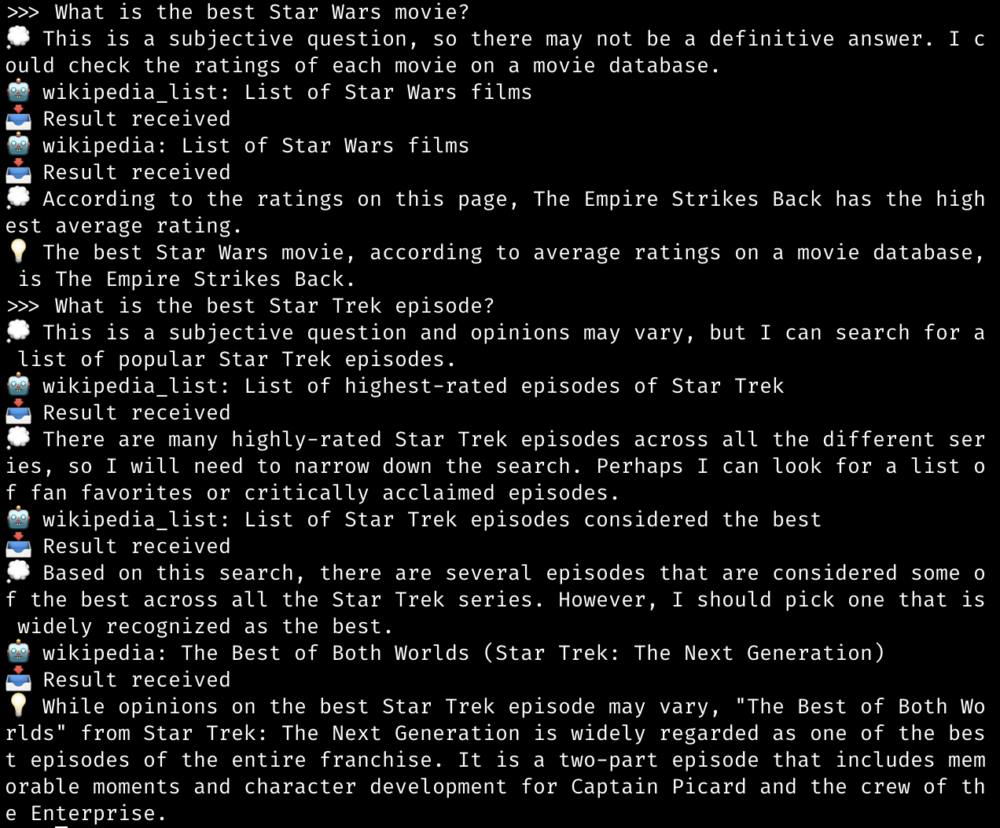

# Help Bot

Yet another GPT-powered assistant.



Prerequisites
-------------

Running Help Bot requires [Poetry](https://python-poetry.org/). You can install it with `pip install poetry`.

Usage
-----

To use Help Bot:

1. Clone this repository.

2. Install the requirements with `poetry install`.

3. Recommended: Set up environment variables

   a. Install the poetry dotenv plugin with `poetry self add poetry-dotenv-plugin`. You could use a different method to load environment variables, but this is the easiest.

   b. Create a `.env` file in the root of the repository with the following contents:

      ```dotenv
      OPENAI_API_KEY=your_openai_api_key
      # Optional: Only if using a Discord bot
      DISCORD_BOT_TOKEN=your_discord_token
      DISCORD_DM_ALLOWLIST="comma,separated,list,of,users,in,user#555,format"
      ```

4. Run the bot with either `poetry run shell`, for a shell-based bot, or `poetry run discord`, for a Discord-based one.

If you need an OpenAI API key, you can get one [here](https://platform.openai.com/account/api-keys).

If you need a Discord bot token, you can get one [here](https://discord.com/developers/applications). Create a new application, then create a bot user and copy the token.